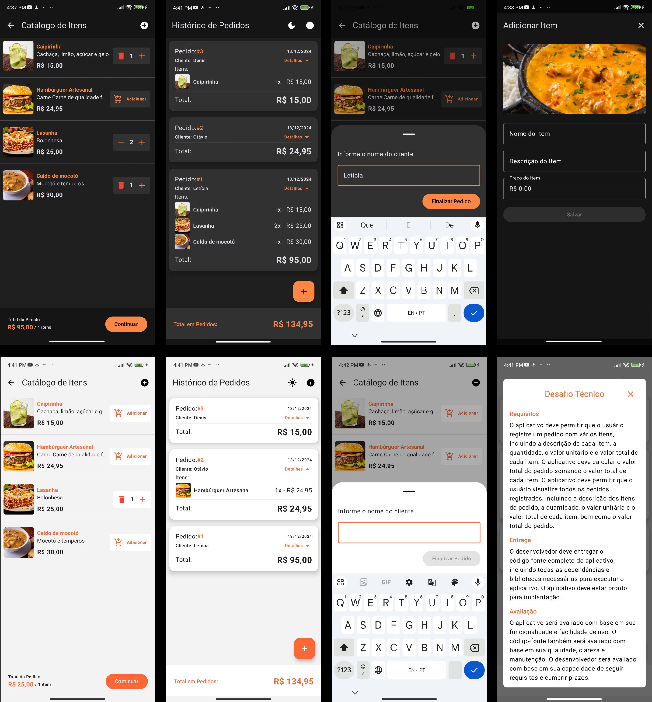

# PedidoApp - Desafio de Aplicativo de Pedidos

## Descrição
Este aplicativo permite o registro de pedidos com múltiplos itens, incluindo a descrição de cada item, quantidade, valor unitário e valor total. O valor total do pedido é calculado automaticamente com base nos itens registrados.

## Funcionalidades
- **Registro de Pedidos**: Permite ao usuário registrar um pedido com múltiplos itens. Cada item inclui:
    - Descrição
    - Quantidade
    - Valor Unitário
    - Valor Total (calculado automaticamente)

- **Cálculo do Valor Total do Pedido**: O aplicativo calcula o valor total do pedido somando o valor total de todos os itens registrados.

- **Visualização de Pedidos**: O usuário pode visualizar todos os pedidos registrados, com os detalhes de cada item e o valor total do pedido.

## Tecnologias e Arquitetura
Este projeto utiliza as seguintes tecnologias e práticas:

- **Kotlin**: Linguagem principal para o desenvolvimento do aplicativo.
- **Jetpack Compose**: Framework de UI para construir a interface de usuário de forma declarativa.
- **Koin**: Framework de injeção de dependência para gerenciar os componentes do aplicativo.
- **Arquitetura MVI (Model-View-Intent)**: Padrão arquitetural utilizado para separar claramente as responsabilidades no código.
- **Clean Architecture**: Estrutura do código organizada em camadas, promovendo a separação de preocupações e facilitando a manutenção.
- **Room**: Biblioteca de persistência para gerenciamento local de dados, utilizado para armazenar os pedidos e itens no banco de dados.

Aqui está a captura de tela do meu projeto:

